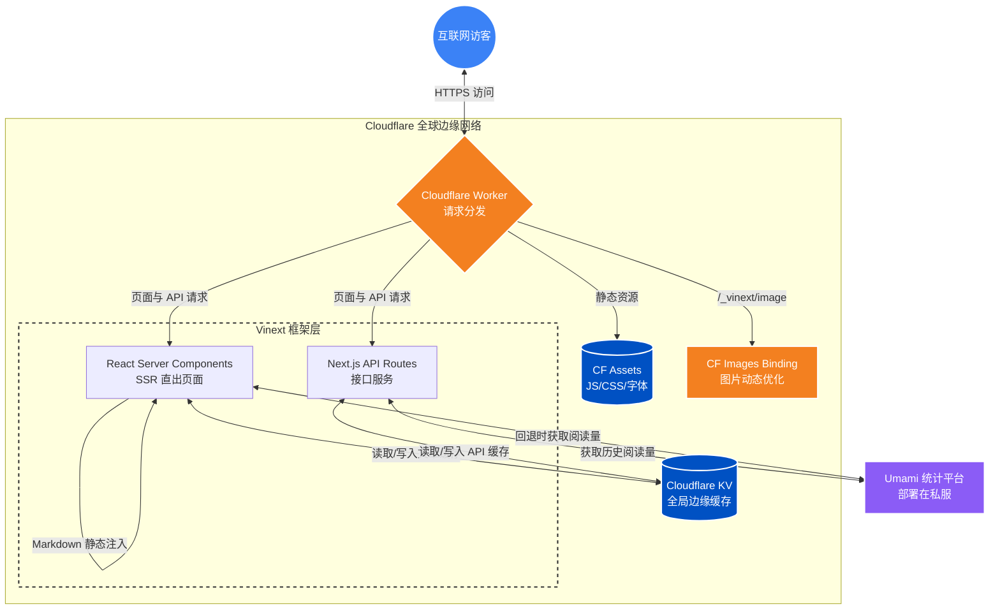

# 项目架构设计 (Architecture Design)

luoleiorg-x 采用了非常前沿的 **Edge Serverless + Next.js Server Components** 架构，完全运行在 Cloudflare 生态之内。

## 核心系统架构图

## 数据与请求流向 (Data Flow)

1. **静态资源请求**: 请求 `/.js`、`/.css` 等静态资源会由 Worker 拦截并直接交由 `Cloudflare Assets` 响应，极速返回。
2. **图片请求**: 访问 `/_vinext/image` 时，Worker 会触发 `Cloudflare Images Binding` 进行实时的图片裁剪和优化。
3. **页面 SSR (React Server Components)**: 
   - 用户访问文章内页时，触发 `Vinext` 的 Server Component 渲染。
   - 文章的 Markdown 依靠 Vite 编译时的 `import.meta.glob` 以字符串形式硬编码打包在 Worker 代码中，省去了耗时的 FS I/O。
   - 文章阅读量尝试走全局 `Cloudflare KV` (缓存键: `umami_pageviews_cache`)。
4. **统计数据 API (Umami)**: 
   - 依赖于第三方的自托管 Umami。
   - 使用 Edge KV 进行长达 6 小时的缓存，防止 Umami 后端被频繁扫描或 DDoS 击穿，实现真正的 Serverless Native 边缘保护。
